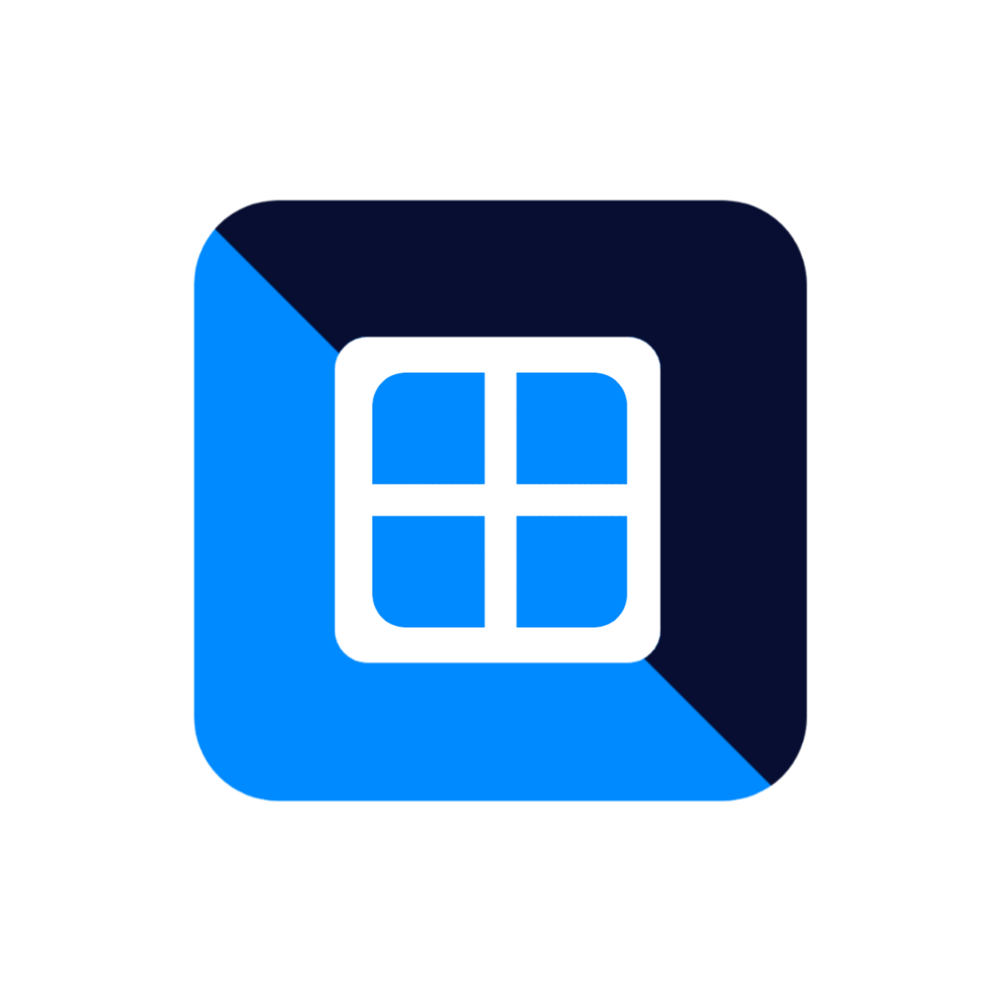

  

# Vectras VM
[![Telegram Channel][ico-telegram]][link-telegram]
[![Latest Version][ico-version]][link-releases]
[![Software License][ico-license]](LICENSE.md)

Welcome to Vectras VM! A virtual machine app for Android based on QEMU that let you emulate various OS including: Windows, MacOS, Linux and Android.

We are, currently, working so hard on rebasing the project, thus, we made the project closed source since the rebased project (v2.8) will be almost completely diffrent from the previous version. Don't worry, we will make the project open source again when the rebase finishs :)

# TODO
- [x] XSDL X11
- [ ] Machine system (like VMWARE)
- [ ] PPC, arch64, i386

# Installation
> [!NOTE]
> Vectras VM 2.8 is still in alpha stages and its releases are intended for testing only.

You can either download Vectras VM from [releases](https://github.com/epicstudios856/Vectras-VM-Android/releases) or [official website](https://vectras.netlify.app/download).

If you are Android 14 user, you may use v2.8. Devices running Android 13 and less can use previous versions.

### Minimum System Requirement
- Android 5.0 and up
- 3GB RAM (1GB of free RAM)
- A good processeur
> [!TIP]
> If the OS you are trying to emulate, crashed try with an older version.

# Donate
Help support the project by funding it.

# Thanks to
- [QEMU](https://github.com/qemu/qemu)
- [PROOT](https://proot-me.github.io/)
- [Android Terminal emulator](https://github.com/jackpal/Android-Terminal-Emulator)
- [Alpine Linux](https://www.alpinelinux.org/)

[ico-telegram]: https://raw.githubusercontent.com/epicstudios856/Vectras-windows-emulator/main/res/images/telegram.svg
[ico-version]: https://raw.githubusercontent.com/epicstudios856/Vectras-windows-emulator/main/res/images/version.svg
[ico-license]: https://img.shields.io/badge/License-GPL_v2-blue.svg

[link-telegram]: https://t.me/vectras_os
[link-repo]: https://github.com/epicstudios856/Vectras-VM-Android/
[link-releases]: https://github.com/epicstudios856/Vectras-VM-Android/releases/
