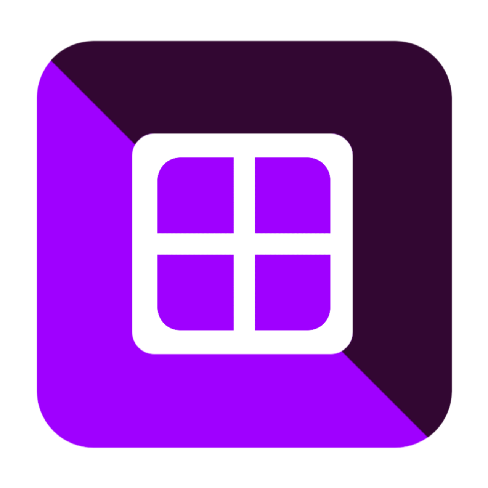

<div align="center">
  
</div>

# 🪴 Vectras VM Github

### 🌱 Community Version for Android

[](https://github.com/xoureldeen/Vectras-VM-Android/releases)
[](https://github.com/xoureldeen/Vectras-VM-Android/releases)
[](#-device-compatibility)
[](LICENSE)
[](https://t.me/vectras_os)
[](https://techforpalestine.org/learn-more)

Vectras VM is a QEMU-based virtual machine app for Android. Create and manage virtual machines, import prepared ROM packages, and experiment with guest operating systems from your phone or tablet.

**This is the original Vectras VM repository**, home of the open-source GitHub Community Version. The [Play Store edition](#-play-store-edition) is a separate product with a different runtime and a simplified experience.

## 📑 Contents

- [Features](#-features)
- [Device compatibility](#-device-compatibility)
- [Installation](#-installation)
- [First-time setup](#-first-time-setup)
- [ROMs and software](#-roms-and-software)
- [Online resources](#-online-resources)
- [Play Store edition](#-play-store-edition)
- [Build from source](#-build-from-source)
- [Community and contributions](#-community-and-contributions)
- [License and policies](#-license-and-policies)
- [Acknowledgements](#-acknowledgements)

## ✨ Features

- Create and configure QEMU virtual machines, including their memory, storage, and boot media.
- Import and export `.cvbi` ROM packages, or use your own disk images and installation media.
- Browse the ROM Store and Software Store for downloadable content.
- Use the bundled bootstrap and Alpine Linux environment through PROOT, with an integrated terminal.
- Choose an online QEMU package or supply a compatible local archive during setup.
- Use supported graphics options, including 3dfx with a suitable QEMU build and guest configuration.

The QEMU version depends on the package you install; it is not fixed by the APK version.

## 📱 Device Compatibility

Works fine on devices manufactured in 2021 or later and devices equipped with Snapdragon 855 CPU or better. You can try running Vectras VM on unsupported devices, but we cannot guarantee stability or support. Here are the devices tested:

| Brands       | Compatibility status |
| ------------ | -------------------- |
| Samsung      | ⭐⭐⭐⭐⭐         |
| Google Pixel | ⭐⭐⭐⭐⭐         |
| Xiaomi       | ⭐⭐⭐⭐⭐         |
| Redmi        | ⭐⭐⭐⭐⭐         |
| Poco         | ⭐⭐⭐⭐⭐         |
| ZTE          | ⭐⭐⭐⭐           |
| RedMagic     | ⭐⭐⭐⭐           |
| Oppo         | ⭐⭐⭐              |
| Realme       | ⭐⭐⭐              |
| OnePlus      | ⭐⭐                |
| vivo         | ⭐⭐                |
| IQOO         | ⭐⭐                |
| Huawei       | ⭐                   |
| Honor        | ⭐                   |

### ⚡ Minimum System Requirements
- Android 6.0 and up.
- 3GB RAM (1GB of free RAM).
- A good processor.

### 💡 Recommended System Requirements
- Android 8.1 and up.
- 8GB RAM (3GB of free RAM).
- CPU and Android OS support 64-bit.
- Snapdragon 855 CPU or better.
- Integrated or removable cooling system (if running operating systems from 2010 to present).
> [!TIP]
> If the OS you are trying to emulate crashes, try using an older version.

## 📥 Installation

Download a Community Version APK from the [GitHub Releases page](https://github.com/xoureldeen/Vectras-VM-Android/releases).

1. Choose the APK matching your Android device's CPU architecture, or choose `universal` if you are unsure.
2. Allow installation from the app you use to open the APK when Android asks.
3. Install Vectras VM and open it to complete the first-time setup below.

Release filenames follow this pattern: `vectras-vm-github-<architecture>-<versionCode>.apk`.

| APK architecture | Package |
| --- | --- |
| Universal | `vectras-vm-github-universal-<versionCode>.apk` |
| ARM64 | `vectras-vm-github-arm64-v8a-<versionCode>.apk` |
| ARM 32-bit | `vectras-vm-github-armeabi-v7a-<versionCode>.apk` |
| x86 | `vectras-vm-github-x86-<versionCode>.apk` |
| x86-64 | `vectras-vm-github-x86_64-<versionCode>.apk` |

`versionCode` is the numeric build identifier, not the dotted app version. The APK architecture describes your Android device, not the architecture of the guest operating system you want to run.

An alternative download listing is available on [OpenAPK](https://www.openapk.net/vectras-vm/com.vectras.vm/). Use GitHub Releases as the reference for this repository's builds and release notes.

## 🚀 First-time setup

The Community Version uses the bootstrap and Alpine Linux environment bundled in the APK. The app extracts this environment during setup; the QEMU package is selected separately.

When prompted, choose one of the two QEMU setup options:

- **Online QEMU:** fetch the download configuration from the bucket repository and download the package specified for your device architecture. An internet connection and an available package link are required.
- **Select QEMU:** choose a compatible QEMU `.tar.gz` archive already saved on your device, for example in Downloads. Use a package intended for your device architecture and the bundled Alpine environment.

Allow extraction and setup to finish before starting a virtual machine. Keep enough free storage for the extracted environment, the QEMU package, and your guest disks.

## 💿 ROMs and software

The **ROM Store** provides a catalog of prepared ROM packages. You can also import a `.cvbi` file that you have downloaded or exported yourself.

For a custom virtual machine, supply your own disk image or installation media and configure the guest architecture, memory, drives, and boot settings. The **Software Store** provides additional downloadable media and tools; attach installation ISOs as CD/DVD media in the virtual machine configuration when appropriate.

Back up important guest disks and exported packages before changing their configuration or replacing files. Only download and use operating systems and software that you are authorized to use; a store listing does not grant a license to third-party content.

## 🌐 Online resources

The app's update, ROM Store, Software Store, and QEMU setup metadata are maintained in [`vectras-vm-bucket/web/data`](https://github.com/xoureldeen/vectras-vm-bucket/tree/main/web/data).

| Metadata file | Purpose |
| --- | --- |
| [`setupfiles.json`](https://github.com/xoureldeen/vectras-vm-bucket/blob/main/web/data/setupfiles.json) | QEMU package download configuration |
| [`vroms-store.json`](https://github.com/xoureldeen/vectras-vm-bucket/blob/main/web/data/vroms-store.json) | ROM Store catalog |
| [`software-store.json`](https://github.com/xoureldeen/vectras-vm-bucket/blob/main/web/data/software-store.json) | Software Store catalog |
| [`UpdateConfig.json`](https://github.com/xoureldeen/vectras-vm-bucket/blob/main/web/data/UpdateConfig.json) | App update metadata, when published |

The app reads these JSON files through GitHub's raw-content URLs. Downloadable archives and disk images are separate assets linked from the JSON, including files hosted in GitHub Releases. Updating a catalog does not require embedding its download files in this source repository.

## 🛒 Play Store edition

The **Play Store edition is a separate, paid, simplified version** of Vectras VM. It runs **QEMU 10 natively on Android**, rather than using the PROOT-based runtime of the GitHub Community Version.

This repository and its installation instructions cover the **Community Version**. The two editions have different runtimes and setup flows; their features and requirements should not be assumed to be identical.

[](https://play.google.com/store/apps/details?id=com.vectrasllc.vm)

## 🔧 Build from source

### 📋 Requirements

- Android Studio with Gradle JDK set to **Java 21**.
- Android SDK Platform **37** and Build Tools **36.1.0**.
- Android NDK **27.3.13750724** and CMake **3.22.1**.
- The repository's Gradle wrapper; it currently selects **Gradle 9.6.1**.

### 🧩 Android Studio

1. Clone this repository and open its root directory in Android Studio.
2. Install the required SDK components and select Java 21 as the Gradle JDK.
3. Sync the project with Gradle.
4. Run `:app:assembleRelease` from the Gradle tool window's **Execute Gradle Task** action. For a debug build, run `:app:assembleDebug` instead.

Release builds produce a universal APK and the four architecture-specific APKs listed above in `app/build/outputs/apk/release/`. The universal debug APK is named `app-debug.apk` and is written to `app/build/outputs/apk/debug/`.

### 💻 Command line

With Java 21 configured in your environment, use the wrapper from the repository root:

```powershell
# Windows
.\gradlew.bat :app:assembleRelease
```

```sh
# Linux / macOS
./gradlew :app:assembleRelease
```

When distributing your own builds, configure your own release signing key and keep its credentials private. Preserve the project's license notices and the licenses of bundled components.

## 🤝 Community and contributions

- [Report a bug or request a feature](https://github.com/xoureldeen/Vectras-VM-Android/issues).
- [Join the Telegram discussion](https://t.me/vectras_chat).
- [Follow the Telegram channel](https://t.me/vectras_os).
- [Join the Discord community](https://discord.gg/t8TACrKSk7).

Bug reports are most useful when they include the app version, device model, Android version, APK architecture, installed QEMU version, relevant VM settings, and steps to reproduce the issue. Remove personal information from logs before sharing them.

Contributions to the app belong in this repository. Catalog and downloadable-content configuration changes belong in the [bucket repository](https://github.com/xoureldeen/vectras-vm-bucket).

## 📜 License and policies

Vectras VM is distributed under the [GNU General Public License v2](LICENSE). Third-party components and guest software remain subject to their own licenses.

Read the [Terms of Service](TERMSOFSERVICE.md) and [Privacy Policy](PRIVACYANDPOLICY.md). Both documents are also accessible from the app's About screen.

## 💖 Acknowledgements

Special thanks to **AnbBui2004** for his code contributions and for the time he spent maintaining the GitHub Community Version of Vectras VM. His work and maintenance efforts are appreciated as part of this project's history.

Thanks also to the projects and contributors whose work makes Vectras VM possible:

- [QEMU](https://github.com/qemu/qemu)
- [QEMU 3dfx patches](https://github.com/kjliew/qemu-3dfx)
- [Alpine Linux](https://www.alpinelinux.org/)
- [PROOT](https://proot-me.github.io/)
- [Termux](https://github.com/termux)
- [Mesa for Android Container](https://github.com/lfdevs/mesa-for-android-container)
- [Glide](https://github.com/bumptech/glide)
- [Gson](https://github.com/google/gson)
- [OkHttp](https://github.com/square/okhttp)
- [ZoomImageView](https://github.com/k1slay/ZoomImageView)
